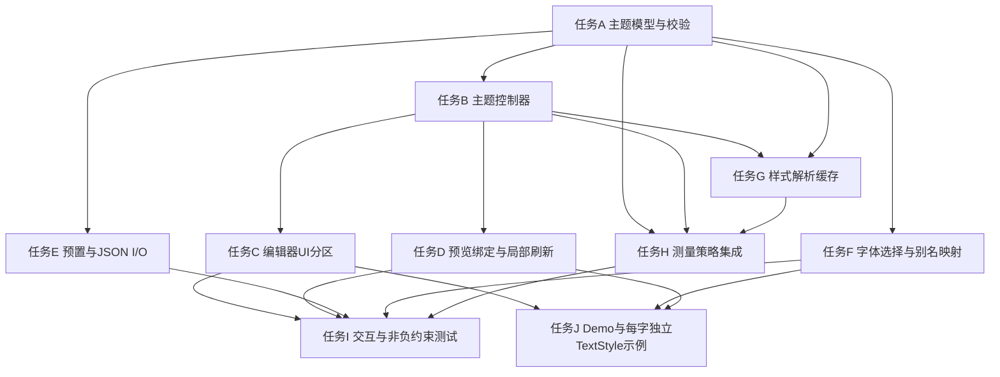

# TASK_CardStylingCustomization（EditableFourZhuCardV3 样式编辑实现任务拆分）

- 创建时间：2025/11/05 14:45
- 依据文档：ALIGNMENT_CardStylingCustomization.md、CONSENSUS_CardStylingCustomization.md、DESIGN_CardStylingCustomization.md
- 目标：按阶段交付样式编辑器、主题解析、预览绑定、持久化与测试闭环

## 1. 任务总览与依赖图

## 2. 任务详细（原子化）

### 任务A：主题模型与校验
- 输入契约：
  - CONSENSUS 中的样式模型字段与约束（Card/Pillar/Cell/Typography，非负约束，perPillarMargin 范围 Year/Month/Day/Hour/DaYun）。
- 输出契约：
  - Dart 数据类 @immutable：CardStyleConfig、PillarStyleConfig（含 margin、perPillarMargin）、CellStyleConfig、TypographyConfig；
  - toJson/fromJson；构造/注入校验（EdgeInsets 非负；perPillarMargin 键校验；颜色与阴影字段合法性）。
- 实现约束：
  - 函数级注释必须包含功能描述、参数说明、返回值类型及用途；
  - 不允许负值（统一校验与错误提示）。
- 验收标准：
  - 单测覆盖 toJson/fromJson 一致性；非法值拒绝；perPillarMargin 键超范围拒绝。

### 任务B：主题控制器（EditableFourZhuThemeController）
- 输入契约：
  - 任务A 输出的主题对象与校验器；
- 输出契约：
  - 控制器 API：updateCardPadding、updatePillarMargin、updatePerPillarMargin、updateShadows、updateFontFamily 等；
  - ValueNotifier/ChangeNotifier 驱动主题更新；
  - 非负约束在控制器层再校验，UI 传入非法值时拒绝并提示。
- 实现约束：
  - 函数级注释完整；
  - 局部刷新：仅影响相关子树；
- 验收标准：
  - 控制器变更能驱动预览局部刷新；非法输入被拒绝且提示。

### 任务C：编辑器 UI 分区
- 输入契约：
  - 任务B 的控制器与当前主题初值；
- 输出契约：
  - EditableFourZhuStyleEditorPanel（Tab：Card/Pillar/Cell/Typography）；
  - CardStyleEditorSection（Padding/Border/Radius/Background/Shadows 的 Slider、输入框与颜色选择器）；
  - PillarStyleEditorSection（全局与 perPillarMargin 的非负编辑器、默认/表头字体编辑）；
  - CellStyleEditorSection（通用装饰与 RowType 字体编辑、分隔行样式）；
  - TypographyEditorSection（全局/perRowType/perPillarType/perToken 字体编辑与 FontFamilySelector）。
- 实现约束：
  - 函数级注释；
  - 非负约束 UI 层即提示；
- 验收标准：
  - 操作流畅、各项变更能够实时反映到预览；
  - 分隔行/列装饰不参与测量的说明在 UI 中标注。

### 任务D：预览绑定与局部刷新
- 输入契约：
  - 任务B 控制器；任务C 编辑面板；
- 输出契约：
  - LivePreviewPane：绑定 EditableFourZhuCardV3 并在主题变更时局部刷新；
  - 拖拽过程尺寸稳定策略（冻结或节流重算）。
- 实现约束：
  - 延迟与节流策略参数化；
- 验收标准：
  - 典型编辑操作（滑动 padding/修改字体）预览无抖动、无明显卡顿。

### 任务E：预置与 JSON I/O
- 输入契约：
  - 任务A 的数据类与版本号策略；
- 输出契约：
  - PresetManager：保存/加载主题；导入/导出 JSON；
- 实现约束：
  - 版本字段必填；兼容保留未知字段；
- 验收标准：
  - 导入/导出返回一致结果；异常 JSON 有说明性错误提示。

### 任务F：字体选择与别名映射
- 输入契约：
  - TypographyConfig；FontFamily 别名映射；系统字体枚举入口（暂缓白名单）。
- 输出契约：
  - FontFamilySelector 组件；别名映射器；回退链拖拽排序；
- 实现约束：
  - 使用 TextStyle.fontFamily 与 fontFamilyFallback；
- 验收标准：
  - 项目内置 + 系统内置字体可选；回退链生效；不可用字体自动回退。

### 任务G：样式解析缓存（ThemeResolver）
- 输入契约：
  - 任务A 数据类；任务B 控制器；
- 输出契约：
  - TextStyle/BoxDecoration 合成缓存（按 RowType/PillarType/token key）；
- 实现约束：
  - 缓存失效与更新策略；
- 验收标准：
  - 在频繁调整样式时保持良好性能。

### 任务H：测量策略集成
- 输入契约：
  - MeasurementContext/CardLayoutModel 现状；CONSENSUS 的测量口径；
- 输出契约：
  - 将 padding/margin/borderWidth 参与测量；分隔行/列装饰不参与测量；
- 实现约束：
  - 非负检查在测量前确保通过；
- 验收标准：
  - 实测列宽/行高符合口径；拖拽时尺寸稳定；margin 影响列间距但不影响内容聚合。

### 任务I：交互与非负约束测试
- 输入契约：
  - 所有前置任务的实现；
- 输出契约：
  - 单元测试与金丝雀快照；
- 实现约束：
  - 覆盖负值拒绝、键范围拒绝、优先级解析、字体回退链、分隔行/列测量稳定；
- 验收标准：
  - 全部测试通过；覆盖典型场景与边界。

### 任务J：Demo 与每字独立 TextStyle 示例
- 输入契约：
  - TypographyEditorSection 与 perToken 配置；
- 输出契约：
  - Demo 页：支持主题切换与十天干/十二地支每个字独立 TextStyle 示例；
- 实现约束：
  - 样式配置实时反映；
- 验收标准：
  - 满足“每个字独立样式”展示；切换主题不崩溃。

## 3. 依赖关系（文本）
- A → B → C → D；A → E、F、G、H；C、D、E、F、H → I；C、D、F → J。

## 4. 质量要求
- 与现有代码风格一致；函数级注释完整；代码易读；
- 主题注入复用现有组件；尽量精简；
- API KEY 等敏感信息放入 .env（本任务不涉及）。

## 5. 风险与应对
- 性能风险：使用缓存与局部刷新；
- 字体兼容：别名映射 + 回退链；
- 认知复杂：UI 明确当前生效层级来源标注。