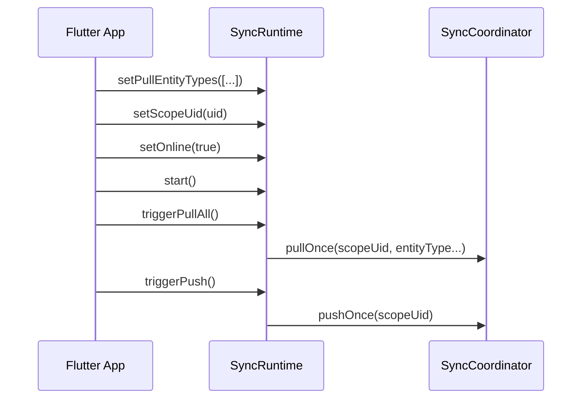

# Persistence Core PRDs

## 5.5 persistence_flutter（装配与生命周期层）——以 SyncRuntime 为核心

本节说明：当业务侧选择不单独维护 `persistence_flutter` 包时，如何在应用层（Flutter）以最小胶水方式正确调用 `persistence_core/lib/sync/sync_runtime.dart`，实现“最佳时机”的 push/pull、scope 切换与退避控制。

### 目标与边界

目标：
- 让 UI/UseCase 不需要理解同步细节，只需依赖状态（可选）与触发点（登录、网络、前后台）。
- 在离线优先前提下，保证：登录后尽快拉取、在线后尽快推送、错误后自动退避、前后台合理节流。

边界：
- `SyncRuntime` 是 pure Dart，不依赖 Flutter 生命周期、Provider、Connectivity 等。
- Flutter 层只负责把事件翻译成对 `SyncRuntime` 的调用，不把 Firebase/Drift/同步语义泄漏给业务。

---

## SyncRuntime API 调用时机（最佳实践）

### 1) 初始化阶段（App 启动 / DI 装配）

最佳时机：
- 应用启动完成依赖注入后（例如 main() 里完成 Firebase 初始化、数据库初始化之后）
- 但在用户真正登录之前也可以创建实例，只是不启动/不设置 scope

推荐调用：
- 创建 `SyncRuntime(coordinator: ..., authScopeProvider: 可选)`
- 调用 `setPullEntityTypes([...])` 提前配置需要 pull 的 entityType 列表（建议在 scope 设置前就配置）
- 此时不必调用 `start()`（未登录时 start 也可，但将因为 scopeUid=null 而 noop）

要点：
- `setPullEntityTypes` 只描述“哪些实体需要周期 pull”，不触发任何业务写入。

### 2) 登录成功（Auth 状态从 null -> uid）

最佳时机：
- FirebaseAuth/自研账号系统明确拿到稳定的 uid 后
- 理想上：在进入主界面之前或刚进入主界面时

推荐调用顺序（强烈建议按这个顺序）：
1. `await runtime.setScopeUid(uid)`
2. `await runtime.start()`（若你习惯全局一直 start，也可以只在首次登录时 start）
3. `await runtime.triggerPullAll()`（可选，但推荐：首次登录立刻拉取，减少等待 timer 周期）
4. `await runtime.triggerPush()`（可选：如果你允许登录前已有 outbox 积压，这里可立即推一次）

原因：
- `setScopeUid` 会重置退避计数，并把 scope 绑定到后续 push/pull。
- `start` 会启用周期调度，保证后续在线、timer tick 等会自动推进同步。
- 首次 `triggerPullAll` 能让“新登录”体验更确定（尤其是 timer 周期较长时）。

### 3) 退出登录（uid -> null）

最佳时机：
- 明确退出登录或 token 失效导致 scope 失效时

推荐调用：
1. `await runtime.setScopeUid(null)`
2. `await runtime.stop()`（推荐：避免任何后台定时器消耗与误触发）

原因：
- scope 置空后 push/pull 均会自动 noop；stop 进一步节省资源。
- 这样能实现 PRD 中的要求：退出登录必须停止同步；outbox 冻结（由 scope 空实现）。

### 4) 网络状态变化（offline <-> online）

最佳时机：
- Connectivity 变化或你们已有网络探测机制判定“可访问互联网/可访问 Firebase”

推荐调用：
- 离线：`await runtime.setOnline(false)`（暂停 push/pull）
- 恢复在线：`await runtime.setOnline(true)`（会触发一次 push + pullAll 的尝试，且受退避约束）

原因：
- 在线恢复应优先 flush outbox（push），并拉取远端增量（pull）以尽快收敛一致性。
- 退避机制保证失败时不会频繁打 Firebase。

### 5) 前后台 / 生命周期（foreground/background）

最佳方案（移动端通用）：
- 前台：保持 `start()` 运行（周期 tick）
- 后台：根据产品策略二选一：
  - 方案A（推荐默认）：`stop()`，只在回到前台再 `start()` 并 `triggerPullAll/triggerPush`
  - 方案B（允许有限后台同步）：保留 `start()`，但把 push/pull interval 调大（需要你们自行实例化不同参数的 runtime 或提供配置层）

推荐调用（方案A）：
- onResume：`await runtime.start()`；`await runtime.triggerPullAll()`（可选）；`await runtime.triggerPush()`（可选）
- onPause：`await runtime.stop()`

原因：
- iOS/Android 后台限制较多，默认 stop 更可控，避免无意义定时器。
- 回前台主动触发一次 pull/push，确保用户立即看到最新数据且尽快上行本地积压。

---

## 推荐的“最佳调用方案”（Flutter 胶水层）

### 单实例、全局持有（推荐）

推荐模式：
- 在应用的顶层 DI 容器（例如 get_it/riverpod/provider 的根作用域）中创建并持有单例 `SyncRuntime`
- 所有事件（Auth、Connectivity、Lifecycle）都只调用这一实例
- UI/UseCase 只订阅 `statusStream`（可选），不直接操作 SyncCoordinator/Outbox/Firestore

事件到 API 的映射表：

| 事件源 | 条件 | 调用 |
|---|---|---|
| App 启动 | DI 完成 | `setPullEntityTypes([...])` |
| 登录成功 | uid != null | `setScopeUid(uid)` -> `start()` -> `triggerPullAll()`（推荐） |
| 退出登录 | uid == null | `setScopeUid(null)` -> `stop()` |
| 网络离线 | online=false | `setOnline(false)` |
| 网络恢复 | online=true | `setOnline(true)`（自动尝试 push + pullAll） |
| 回到前台 | resumed | `start()`（必要）+ `triggerPullAll()`（推荐） |
| 进入后台 | paused/inactive | `stop()`（推荐默认） |

### 推荐的时序（登录后的首次收敛）

---

## 易踩坑与约束（必须遵守）

- 不要在未登录/无 scopeUid 时强行 push/pull：应通过 `setScopeUid` 作为唯一入口绑定用户。
- 不要在网络不稳定时自行循环重试：交给 `SyncRuntime` 的退避；上层只需要更新 online 状态。
- 不要把 pull 的“回填本地”再写入 outbox：这是适配层（localApplier/outboxStore）必须保证的“防回环”要求。
- 不要在多个地方创建多个 SyncRuntime：多实例会导致并发 push/pull、状态混乱、重复请求与退避失效。

---

## 最小可用验收标准（针对调用方案）

- 登录后 1 个周期内（或手动 trigger 后）能够触发至少一次 pull 与一次 push（若有积压）。
- 退出登录后不再发生任何远端请求（scopeUid=null 且已 stop）。
- 离线时不发生远端请求；恢复在线后会尝试 push/pull（且失败会退避，不会高频请求）。
- 回到前台后能快速触发一次 pull，用户看到最新数据。