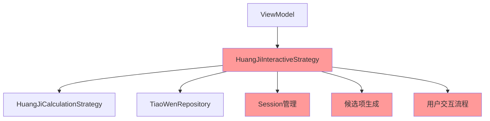
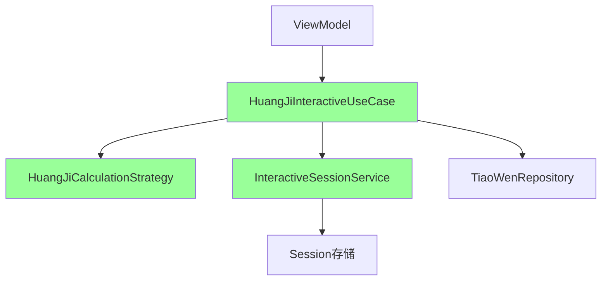
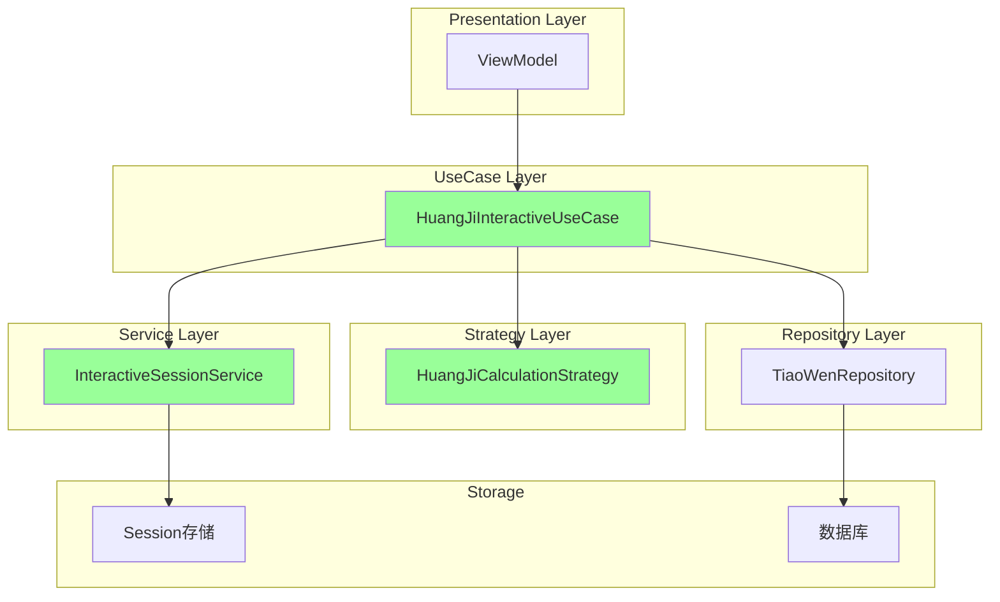
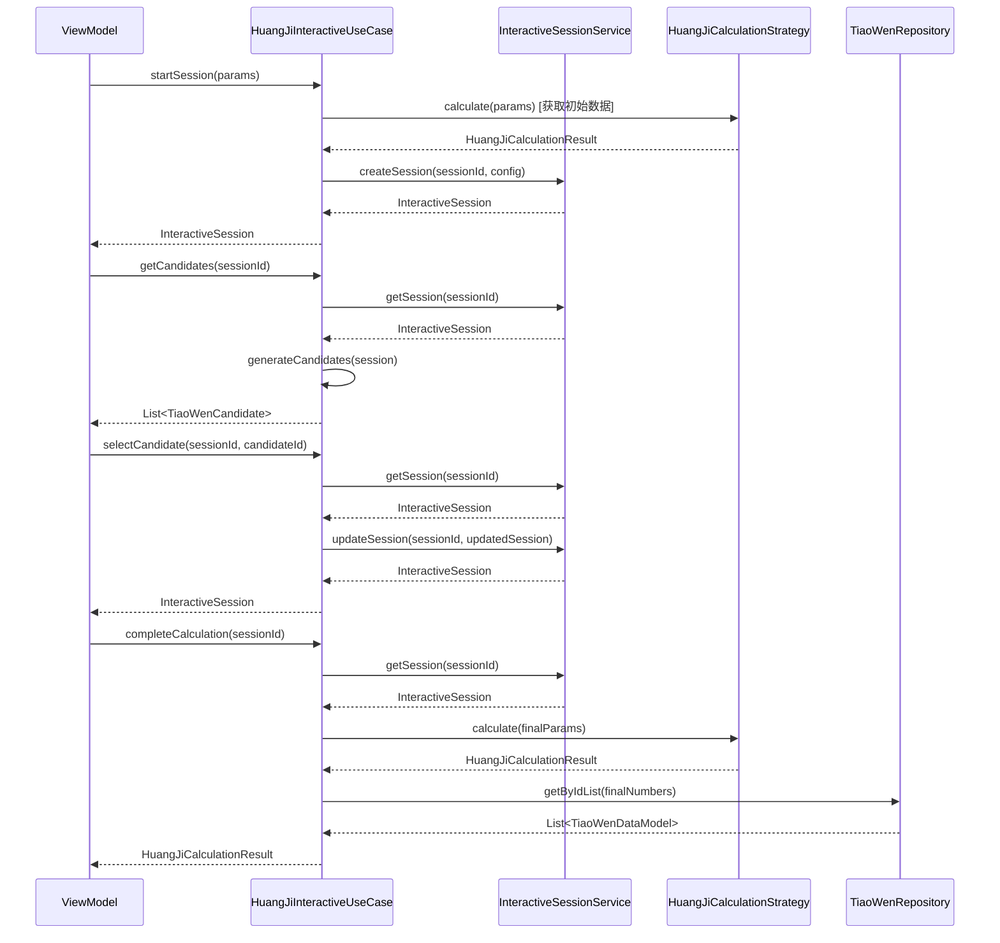
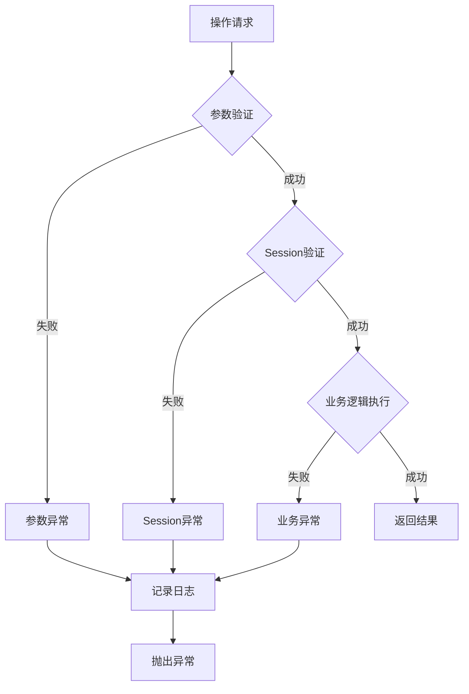

# HuangJi Interactive Strategy重构 - 设计文档

## 整体架构设计

### 重构前架构 (违规)


### 重构后架构 (合规)


## 分层设计和核心组件

### 1. UseCase层 - HuangJiInteractiveUseCase

#### 职责
- 协调Interactive业务流程
- 管理用户交互生命周期
- 协调计算和数据访问

#### 核心方法
```dart
class HuangJiInteractiveUseCase {
  // Session管理
  Future<InteractiveSession> startSession(HuangJiCalculationParams params);
  Future<InteractiveSession?> getSession(String sessionId);
  Future<InteractiveSession> cancelSession(String sessionId);
  
  // 用户交互
  Future<List<TiaoWenCandidate>> getCandidates(String sessionId);
  Future<InteractiveSession> selectCandidate(String sessionId, String candidateId);
  
  // 流程控制
  Future<InteractiveSession> jumpTo(String sessionId, int stepIndex);
  Future<InteractiveSession> undo(String sessionId);
  
  // 计算完成
  Future<HuangJiCalculationResult> completeCalculation(String sessionId);
}
```

#### 依赖关系
```dart
class HuangJiInteractiveUseCase {
  final HuangJiCalculationStrategy _calculationStrategy;
  final InteractiveSessionService _sessionService;
  final TiaoWenRepository _tiaoWenRepository;
}
```

### 2. Service层 - InteractiveSessionService

#### 职责
- 专门的Session管理
- Session状态维护
- Session生命周期管理

#### 核心方法
```dart
class InteractiveSessionService {
  // CRUD操作
  Future<InteractiveSession> createSession(String sessionId, Map<String, dynamic> config);
  Future<InteractiveSession?> getSession(String sessionId);
  Future<InteractiveSession> updateSession(String sessionId, InteractiveSession session);
  Future<void> deleteSession(String sessionId);
  
  // 状态管理
  Future<InteractiveSession> updateSessionStatus(String sessionId, InteractiveSessionStatus status);
  Future<InteractiveSession> updateSessionStep(String sessionId, int stepIndex);
  Future<InteractiveSession> updateSessionData(String sessionId, Map<String, dynamic> data);
  
  // 验证
  bool validateSession(InteractiveSession session);
  bool isSessionExpired(InteractiveSession session);
}
```

### 3. Strategy层 - HuangJiCalculationStrategy (保持不变)

#### 职责
- 纯粹的baseNumber计算
- 无状态、无依赖
- 纯函数式计算组件

#### 核心方法
```dart
class HuangJiCalculationStrategy {
  @override
  HuangJiCalculationResult calculate(HuangJiCalculationParams params);
  
  @override
  void validateParams(HuangJiCalculationParams params);
  
  bool isValidCandidateNumber(int number);
}
```

## 模块依赖关系图



## 接口契约定义

### HuangJiInteractiveUseCase接口

```dart
abstract class HuangJiInteractiveUseCase {
  /// 启动交互式会话
  /// 
  /// [params] 计算参数
  /// [config] 可选的会话配置
  /// 返回创建的会话对象
  Future<InteractiveSession> startSession(
    HuangJiCalculationParams params, {
    InteractiveStrategyConfig? config,
  });

  /// 获取候选项列表
  /// 
  /// [sessionId] 会话ID
  /// 返回当前步骤的候选项列表
  Future<List<TiaoWenCandidate>> getCandidates(String sessionId);

  /// 选择候选项
  /// 
  /// [sessionId] 会话ID
  /// [candidateId] 候选项ID
  /// 返回更新后的会话对象
  Future<InteractiveSession> selectCandidate(String sessionId, String candidateId);

  /// 完成计算
  /// 
  /// [sessionId] 会话ID
  /// 返回最终计算结果
  Future<HuangJiCalculationResult> completeCalculation(String sessionId);
}
```

### InteractiveSessionService接口

```dart
abstract class InteractiveSessionService {
  /// 创建新会话
  Future<InteractiveSession> createSession(String sessionId, Map<String, dynamic> config);
  
  /// 获取会话
  Future<InteractiveSession?> getSession(String sessionId);
  
  /// 更新会话
  Future<InteractiveSession> updateSession(String sessionId, InteractiveSession session);
  
  /// 删除会话
  Future<void> deleteSession(String sessionId);
  
  /// 验证会话
  bool validateSession(InteractiveSession session);
}
```

## 数据流向图



## 异常处理策略

### 异常类型定义
```dart
// 保持现有异常类型
class HuangJiInteractiveSessionException extends TiaoWenCalculationException {
  final String? sessionId;
  final String? currentStep;
  final String? expectedStep;
  
  HuangJiInteractiveSessionException({
    required String message,
    this.sessionId,
    this.currentStep,
    this.expectedStep,
    Object? originalException,
  }) : super(message: message, originalException: originalException);
}
```

### 异常处理流程


## 迁移计划

### 阶段1: 创建新组件
1. 创建`InteractiveSessionService`类
2. 创建`HuangJiInteractiveUseCase`类
3. 定义接口契约

### 阶段2: 迁移核心逻辑
1. 迁移Session管理逻辑到`InteractiveSessionService`
2. 迁移业务流程逻辑到`HuangJiInteractiveUseCase`
3. 迁移候选项生成逻辑到`HuangJiInteractiveUseCase`

### 阶段3: 更新调用方
1. 修改ViewModel调用方式
2. 更新依赖注入配置
3. 更新相关测试

### 阶段4: 清理旧代码
1. 删除`HuangJiInteractiveStrategy`类
2. 清理相关导入
3. 更新文档

## 性能考虑

### 优化策略
1. **Session缓存**: 在内存中缓存活跃Session
2. **懒加载**: 候选项按需生成
3. **批量操作**: 批量处理Repository操作
4. **异步处理**: 所有IO操作异步化

### 性能指标
- Session创建时间 < 100ms
- 候选项生成时间 < 200ms
- 计算完成时间 < 500ms
- 内存使用合理，无内存泄漏

## 测试策略

### 单元测试
- `InteractiveSessionService`的CRUD操作
- `HuangJiInteractiveUseCase`的业务逻辑
- 异常处理逻辑

### 集成测试
- UseCase与Strategy的集成
- UseCase与Repository的集成
- 完整的Interactive流程测试

### 兼容性测试
- 现有API接口兼容性
- 数据格式兼容性
- 异常处理兼容性