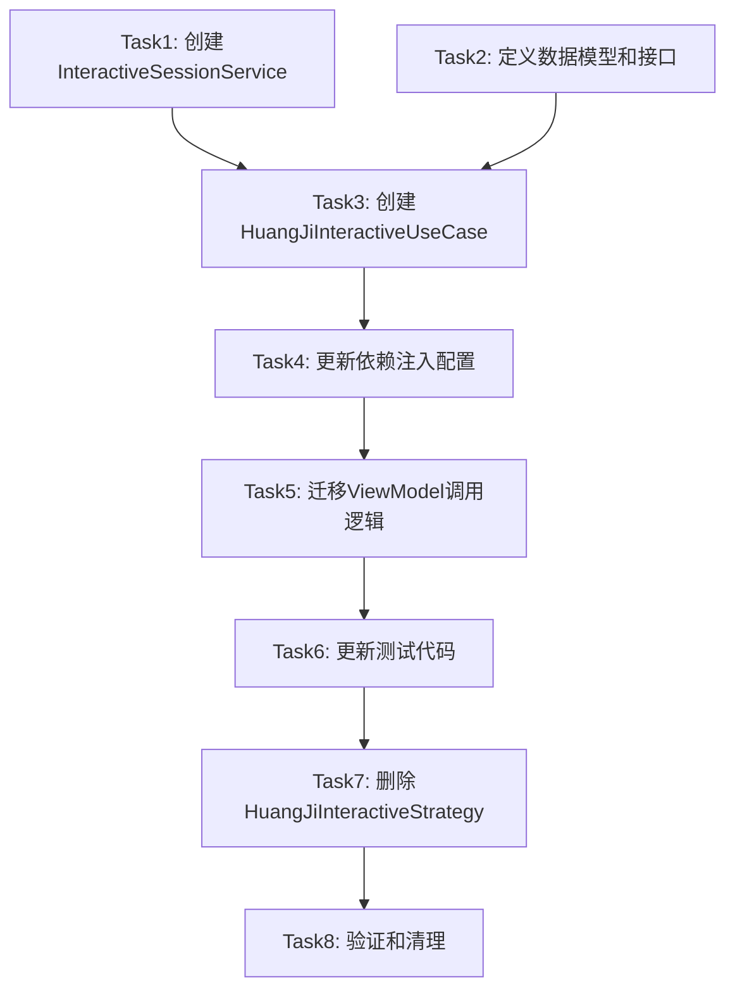

# HuangJi Interactive Strategy重构 - 任务拆分文档

## 任务概述

基于DESIGN文档，将`HuangJiInteractiveStrategy`重构拆分为以下原子任务，确保每个任务独立可执行、可验证。

## 任务依赖关系图

## 原子任务详细定义

### Task1: 创建InteractiveSessionService

#### 输入契约
- **前置依赖**: 无
- **输入数据**: DESIGN文档中的InteractiveSessionService接口定义
- **环境依赖**: Dart开发环境，现有项目结构

#### 输出契约
- **输出数据**: 
  - `lib/domain/services/interactive_session_service.dart` (抽象接口)
  - `lib/data/services/interactive_session_service_impl.dart` (具体实现)
- **交付物**: 完整的Session管理服务
- **验收标准**: 
  - 接口定义完整，包含所有CRUD操作
  - 实现类通过单元测试
  - 代码符合项目规范

#### 实现约束
- **技术栈**: Dart, Flutter
- **接口规范**: 遵循现有Repository模式
- **质量要求**: 单元测试覆盖率 > 90%

#### 依赖关系
- **后置任务**: Task3 (HuangJiInteractiveUseCase需要依赖此服务)
- **并行任务**: Task2 (可以并行进行)

---

### Task2: 定义数据模型和接口

#### 输入契约
- **前置依赖**: 无
- **输入数据**: 现有的InteractiveSession相关模型
- **环境依赖**: 现有数据模型结构

#### 输出契约
- **输出数据**: 
  - 更新`InteractiveSession`模型（如需要）
  - 定义`TiaoWenCandidate`模型（如不存在）
  - 定义相关枚举和常量
- **交付物**: 完整的数据模型定义
- **验收标准**: 
  - 模型定义清晰，字段完整
  - 序列化/反序列化正常
  - 与现有模型兼容

#### 实现约束
- **技术栈**: Dart, json_annotation
- **接口规范**: 遵循现有模型定义模式
- **质量要求**: 模型测试完整

#### 依赖关系
- **后置任务**: Task3 (UseCase需要使用这些模型)
- **并行任务**: Task1 (可以并行进行)

---

### Task3: 创建HuangJiInteractiveUseCase

#### 输入契约
- **前置依赖**: Task1, Task2
- **输入数据**: 
  - InteractiveSessionService接口
  - 数据模型定义
  - 现有HuangJiCalculationStrategy
- **环境依赖**: 现有UseCase层结构

#### 输出契约
- **输出数据**: 
  - `lib/domain/usecases/huang_ji_interactive_usecase.dart` (抽象接口)
  - `lib/domain/usecases/huang_ji_interactive_usecase_impl.dart` (具体实现)
- **交付物**: 完整的Interactive业务逻辑UseCase
- **验收标准**: 
  - 所有业务方法实现完整
  - 与HuangJiCalculationStrategy正确集成
  - 通过集成测试

#### 实现约束
- **技术栈**: Dart, Flutter
- **接口规范**: 遵循现有UseCase模式
- **质量要求**: 
  - 单元测试覆盖率 > 90%
  - 集成测试覆盖主要流程

#### 依赖关系
- **后置任务**: Task4 (需要配置依赖注入)
- **并行任务**: 无

---

### Task4: 更新依赖注入配置

#### 输入契约
- **前置依赖**: Task1, Task2, Task3
- **输入数据**: 
  - 新创建的Service和UseCase
  - 现有依赖注入配置
- **环境依赖**: 现有DI框架（get_it或类似）

#### 输出契约
- **输出数据**: 更新的依赖注入配置文件
- **交付物**: 完整的依赖关系配置
- **验收标准**: 
  - 所有新组件正确注册
  - 依赖关系正确配置
  - 应用启动正常

#### 实现约束
- **技术栈**: 现有DI框架
- **接口规范**: 遵循现有DI模式
- **质量要求**: 配置正确，无循环依赖

#### 依赖关系
- **后置任务**: Task5 (ViewModel需要注入新的UseCase)
- **并行任务**: 无

---

### Task5: 迁移ViewModel调用逻辑

#### 输入契约
- **前置依赖**: Task4
- **输入数据**: 
  - 现有ViewModel代码
  - 新的HuangJiInteractiveUseCase
- **环境依赖**: 现有ViewModel结构

#### 输出契约
- **输出数据**: 更新的ViewModel文件
- **交付物**: 迁移后的ViewModel逻辑
- **验收标准**: 
  - 所有Interactive调用迁移到UseCase
  - 功能行为保持一致
  - UI测试通过

#### 实现约束
- **技术栈**: Dart, Flutter
- **接口规范**: 保持现有ViewModel接口不变
- **质量要求**: 
  - 功能完全兼容
  - 性能无明显下降

#### 依赖关系
- **后置任务**: Task6 (需要更新相关测试)
- **并行任务**: 无

---

### Task6: 更新测试代码

#### 输入契约
- **前置依赖**: Task5
- **输入数据**: 
  - 现有测试代码
  - 新的组件结构
- **环境依赖**: 现有测试框架

#### 输出契约
- **输出数据**: 更新的测试文件
- **交付物**: 完整的测试套件
- **验收标准**: 
  - 所有测试通过
  - 测试覆盖率满足要求
  - Mock和Stub正确配置

#### 实现约束
- **技术栈**: Dart测试框架, mockito
- **接口规范**: 遵循现有测试模式
- **质量要求**: 
  - 单元测试覆盖率 > 90%
  - 集成测试覆盖主要场景

#### 依赖关系
- **后置任务**: Task7 (测试通过后才能删除旧代码)
- **并行任务**: 无

---

### Task7: 删除HuangJiInteractiveStrategy

#### 输入契约
- **前置依赖**: Task6
- **输入数据**: 
  - 现有HuangJiInteractiveStrategy文件
  - 相关导入和引用
- **环境依赖**: 完整的项目代码库

#### 输出契约
- **输出数据**: 删除旧文件，清理引用
- **交付物**: 清理后的代码库
- **验收标准**: 
  - HuangJiInteractiveStrategy文件已删除
  - 所有相关引用已清理
  - 项目编译通过

#### 实现约束
- **技术栈**: 代码搜索和重构工具
- **接口规范**: 确保无遗留引用
- **质量要求**: 完全清理，无编译错误

#### 依赖关系
- **后置任务**: Task8 (最终验证)
- **并行任务**: 无

---

### Task8: 验证和清理

#### 输入契约
- **前置依赖**: Task7
- **输入数据**: 完整的重构后代码库
- **环境依赖**: 完整的开发和测试环境

#### 输出契约
- **输出数据**: 验证报告和清理结果
- **交付物**: 完成的重构项目
- **验收标准**: 
  - 所有功能正常工作
  - 性能指标满足要求
  - 代码质量检查通过
  - 文档更新完整

#### 实现约束
- **技术栈**: 全栈验证工具
- **接口规范**: 符合项目质量标准
- **质量要求**: 
  - 功能完整性 100%
  - 性能无明显下降
  - 代码质量达标

#### 依赖关系
- **后置任务**: 无
- **并行任务**: 无

## 风险评估

### 高风险任务
- **Task3**: HuangJiInteractiveUseCase实现复杂度较高
- **Task5**: ViewModel迁移可能影响UI行为

### 风险缓解策略
1. **分步验证**: 每个任务完成后立即验证
2. **回滚准备**: 保留原代码备份
3. **渐进迁移**: 可以考虑分阶段迁移功能

## 质量门控

### 每个任务的质量检查点
1. **代码编译**: 无编译错误
2. **单元测试**: 覆盖率 > 90%
3. **集成测试**: 主要流程通过
4. **代码审查**: 符合项目规范
5. **性能验证**: 无明显性能下降

### 整体质量验收标准
1. **功能完整性**: 所有Interactive功能正常
2. **架构合规性**: 符合Strategy层纯计算原则
3. **代码质量**: 通过静态分析检查
4. **测试质量**: 测试套件完整且通过
5. **文档同步**: 相关文档已更新