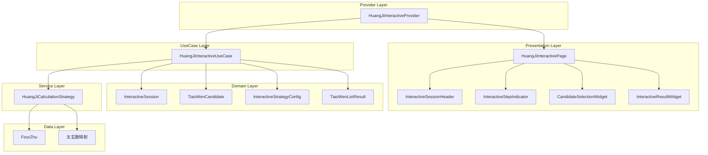
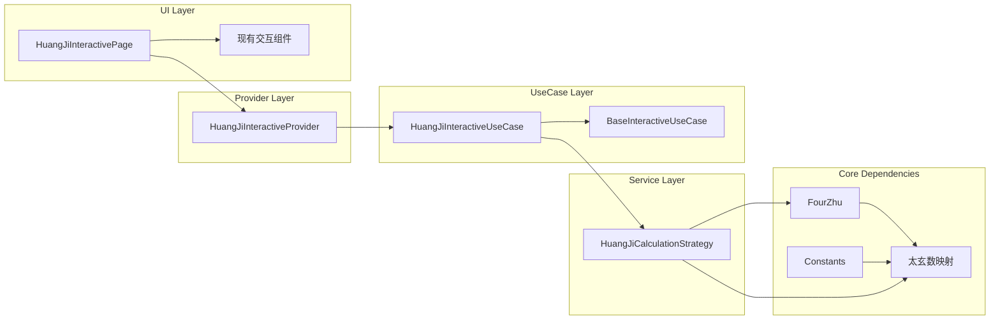
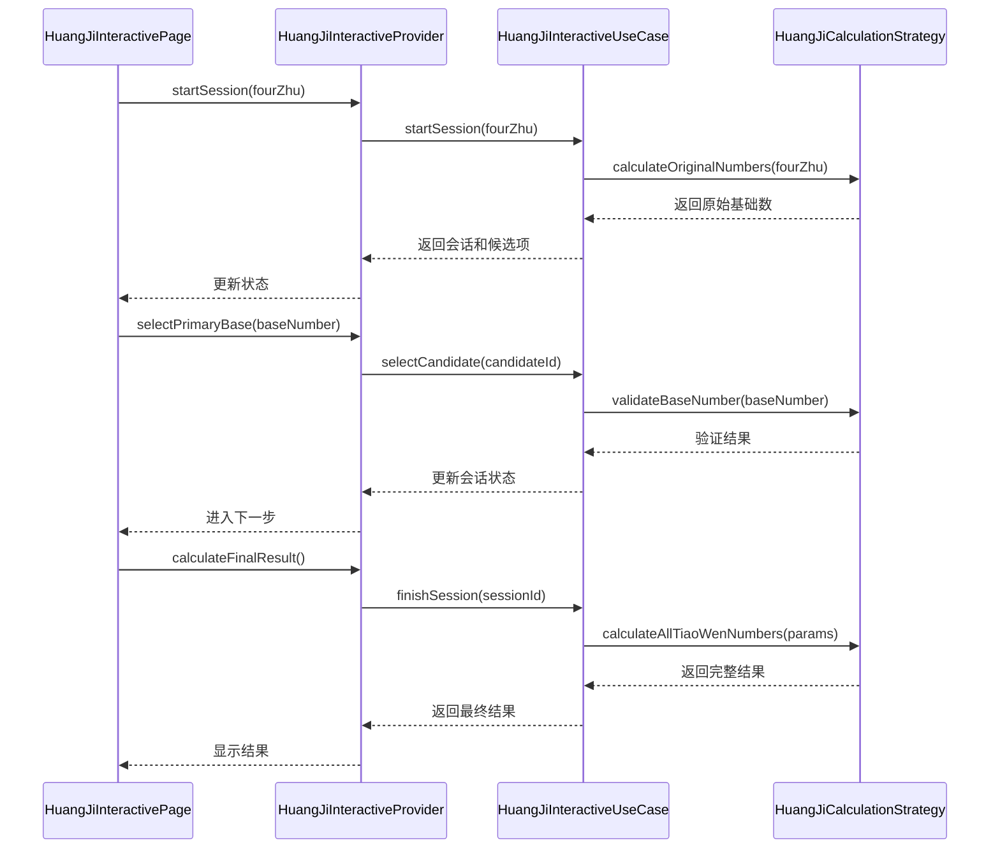
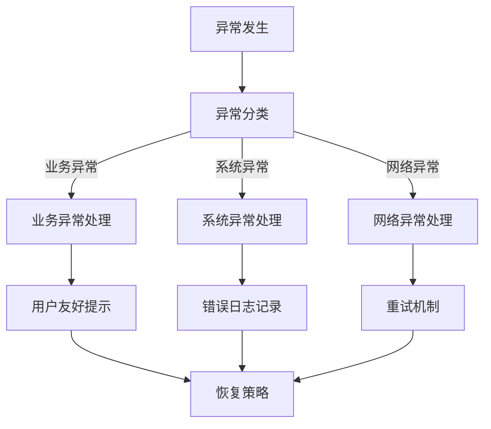

# 皇极取数法重构架构设计文档

## 整体架构图



## 分层设计

### 1. Presentation Layer (表现层)

#### 1.1 可复用的现有组件
- **InteractiveSessionHeader**: 显示会话基本信息
- **InteractiveStepIndicator**: 步骤进度指示器
- **CandidateSelectionWidget**: 候选项选择组件
- **InteractiveResultWidget**: 结果展示组件

#### 1.2 新增组件
- **HuangJiInteractivePage**: 皇极取数法专用交互页面
- **BaseNumberAdjustmentWidget**: 基础数调整专用组件

### 2. Provider Layer (状态管理层)

#### 2.1 HuangJiInteractiveProvider
```dart
class HuangJiInteractiveProvider extends ChangeNotifier {
  final HuangJiInteractiveUseCase _useCase;
  
  // 状态管理
  InteractiveProviderState _state;
  InteractiveSession? _currentSession;
  List<TiaoWenCandidate> _currentCandidates;
  HuangJiCalculationResult? _finalResult;
  
  // 皇极取数法特有状态
  int? _selectedPrimaryBaseNumber;
  int? _selectedSecondaryBaseNumber;
  List<int> _primaryCandidateNumbers;
  List<int> _secondaryCandidateNumbers;
}
```

### 3. UseCase Layer (用例层)

#### 3.1 HuangJiInteractiveUseCase
继承自 `BaseInteractiveUseCase<FourZhu>`

**核心方法：**
- `startSession()`: 启动皇极取数法交互会话
- `getCandidates()`: 获取基础数候选项
- `selectCandidate()`: 选择基础数
- `calculateFinalResult()`: 计算最终条文列表

**交互步骤定义：**
1. **确认四柱信息** - 验证输入的四柱数据
2. **选择主基础数** - 用户选择元会基础数（规则5）
3. **选择次基础数** - 用户选择运世基础数（可选）
4. **计算条文列表** - 基于选择的基础数计算12种条文数

### 4. Domain Layer (领域层)

#### 4.1 核心模型

**HuangJiCalculationParams**
```dart
class HuangJiCalculationParams {
  final FourZhu fourZhu;
  final int? primaryBaseNumber;
  final int? secondaryBaseNumber;
  final HuangJiCalculationConfig config;
}
```

**HuangJiCalculationResult**
```dart
class HuangJiCalculationResult extends TiaoWenListResult {
  final int yuanHuiNumber;
  final int yunShiNumber;
  final int originalPrimaryNumber;
  final int originalSecondaryNumber;
  final int selectedPrimaryBaseNumber;
  final int selectedSecondaryBaseNumber;
  final List<HuangJiTiaoWenItem> tiaoWenItems;
}
```

**HuangJiTiaoWenItem**
```dart
class HuangJiTiaoWenItem extends TiaoWenItem {
  final String calculationRule;  // 计算规则描述
  final Map<String, dynamic> calculationDetails;  // 计算详情
}
```

#### 4.2 交互式会话步骤

**Step 1: 四柱确认**
```dart
InteractiveSessionStep(
  stepName: "四柱确认",
  description: "确认四柱信息和太玄数计算",
  candidates: [confirmCandidate, modifyCandidate],
)
```

**Step 2: 主基础数选择**
```dart
InteractiveSessionStep(
  stepName: "主基础数选择", 
  description: "选择元会基础数（规则5：如不符合按30递增/递减）",
  candidates: generatePrimaryBaseCandidates(),
)
```

**Step 3: 次基础数选择（可选）**
```dart
InteractiveSessionStep(
  stepName: "次基础数选择",
  description: "选择运世基础数（可选调整）", 
  candidates: generateSecondaryBaseCandidates(),
)
```

### 5. Service Layer (服务层)

#### 5.1 HuangJiCalculationStrategy
重构自原 `TiaoWenNumberCalculationStrategy`

**核心职责：**
- 四柱太玄数计算
- 元会数和运世数计算
- 基础数候选项生成
- 12种条文数计算

**主要方法：**
```dart
class HuangJiCalculationStrategy {
  // 基础计算
  int calculateYuanHuiNumber(FourZhu fourZhu);
  int calculateYunShiNumber(FourZhu fourZhu);
  int calculateOriginalPrimaryNumber(FourZhu fourZhu);
  int calculateOriginalSecondaryNumber(FourZhu fourZhu);
  
  // 候选项生成
  List<int> generatePrimaryBaseCandidates(int originalNumber, {int count = 21});
  List<int> generateSecondaryBaseCandidates(int originalNumber, {int count = 21});
  
  // 条文数计算
  List<HuangJiTiaoWenItem> calculateAllTiaoWenNumbers(
    FourZhu fourZhu,
    int primaryBaseNumber,
    int secondaryBaseNumber,
  );
}
```

## 模块依赖关系图



## 接口契约定义

### 1. UseCase接口

```dart
abstract class HuangJiInteractiveUseCase extends BaseInteractiveUseCase<FourZhu> {
  @override
  String get name => "皇极取数法交互式计算";
  
  @override
  String get description => "基于四柱的皇极取数法，支持用户参与基础数选择";
  
  // 皇极取数法特有方法
  Future<List<int>> generatePrimaryBaseCandidates(String sessionId);
  Future<List<int>> generateSecondaryBaseCandidates(String sessionId);
  Future<HuangJiCalculationResult> calculateWithSelectedBases(
    String sessionId,
    int primaryBase,
    int secondaryBase,
  );
}
```

### 2. Provider接口

```dart
abstract class HuangJiInteractiveProvider extends ChangeNotifier {
  // 基础交互方法
  Future<void> startSession(FourZhu fourZhu, {InteractiveStrategyConfig? config});
  Future<void> selectPrimaryBase(int baseNumber);
  Future<void> selectSecondaryBase(int baseNumber);
  Future<void> calculateFinalResult();
  
  // 状态查询
  bool get canSelectPrimaryBase;
  bool get canSelectSecondaryBase;
  bool get canCalculateFinal;
  List<int> get primaryBaseCandidates;
  List<int> get secondaryBaseCandidates;
  HuangJiCalculationResult? get finalResult;
}
```

## 数据流向图



## 异常处理策略

### 1. 异常分类

```dart
// 皇极取数法特有异常
class HuangJiCalculationException extends TiaoWenCalculationException {
  final HuangJiErrorType errorType;
}

enum HuangJiErrorType {
  invalidFourZhu,           // 无效四柱
  invalidBaseNumber,        // 无效基础数
  calculationOverflow,      // 计算溢出
  taixuanMappingError,     // 太玄数映射错误
}
```

### 2. 错误处理流程



## 复用现有组件策略

### 1. 直接复用组件
- `InteractiveSessionHeader`: 显示会话信息
- `InteractiveStepIndicator`: 步骤进度
- `CandidateSelectionWidget`: 候选项选择
- `InteractiveResultWidget`: 结果展示

### 2. 扩展现有组件
- `CandidateSelectionWidget`: 增加数值类型候选项的特殊显示
- `InteractiveResultWidget`: 增加皇极取数法结果的详细展示

### 3. 新增专用组件
- `BaseNumberAdjustmentWidget`: 基础数调整专用界面
- `HuangJiCalculationDetailsWidget`: 计算过程详情展示

## 集成方案

### 1. Provider注册
```dart
// 在main.dart或provider配置文件中
MultiProvider(
  providers: [
    // 现有providers...
    ChangeNotifierProvider(
      create: (context) => HuangJiInteractiveProvider(
        context.read<HuangJiInteractiveUseCase>(),
      ),
    ),
  ],
)
```

### 2. 路由配置
```dart
// 在路由配置中添加
'/huang_ji_interactive': (context) => const HuangJiInteractivePage(),
```

### 3. UseCase注册
```dart
// 在依赖注入配置中
GetIt.instance.registerLazySingleton<HuangJiInteractiveUseCase>(
  () => HuangJiInteractiveUseCaseImpl(
    GetIt.instance<HuangJiCalculationStrategy>(),
  ),
);
```