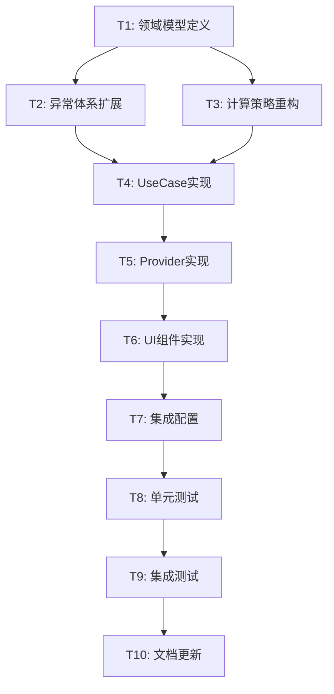

# 皇极取数法重构任务拆分文档

## 任务依赖关系图

## 原子任务详细定义

### T1: 领域模型定义
**优先级**: 高 | **预估时间**: 2小时 | **复杂度**: 中

#### 输入契约
- **前置依赖**: DESIGN文档完成
- **输入数据**: 现有TiaoWenListResult、TiaoWenItem模型
- **环境依赖**: Dart开发环境

#### 输出契约
- **输出数据**: 
  - `HuangJiCalculationParams` 类
  - `HuangJiCalculationResult` 类  
  - `HuangJiTiaoWenItem` 类
  - `HuangJiCalculationConfig` 类
- **交付物**: 
  - `/lib/domain/models/huang_ji_calculation_params.dart`
  - `/lib/domain/models/huang_ji_calculation_result.dart`
  - `/lib/domain/models/huang_ji_tiao_wen_item.dart`
  - `/lib/domain/models/huang_ji_calculation_config.dart`
- **验收标准**: 
  - 所有模型类编译通过
  - 继承关系正确（HuangJiCalculationResult extends TiaoWenListResult）
  - 包含完整的构造函数、copyWith方法、toString方法
  - 添加完整的文档注释

#### 实现约束
- **技术栈**: Dart
- **接口规范**: 遵循现有模型类的设计模式
- **质量要求**: 
  - 代码覆盖率 > 90%
  - 所有公共方法有文档注释
  - 遵循项目命名约定

#### 依赖关系
- **后置任务**: T2, T3
- **并行任务**: 无

---

### T2: 异常体系扩展
**优先级**: 高 | **预估时间**: 1小时 | **复杂度**: 低

#### 输入契约
- **前置依赖**: T1完成
- **输入数据**: 现有异常体系 `TiaoWenCalculationException`
- **环境依赖**: Dart开发环境

#### 输出契约
- **输出数据**: 
  - `HuangJiCalculationException` 类
  - `HuangJiErrorType` 枚举
- **交付物**: 
  - `/lib/domain/exceptions/huang_ji_calculation_exceptions.dart`
- **验收标准**: 
  - 异常类正确继承现有异常体系
  - 包含所有必要的错误类型
  - 提供用户友好的错误消息

#### 实现约束
- **技术栈**: Dart
- **接口规范**: 继承自 `TiaoWenCalculationException`
- **质量要求**: 异常消息本地化支持

#### 依赖关系
- **前置任务**: T1
- **后置任务**: T4
- **并行任务**: T3

---

### T3: 计算策略重构
**优先级**: 高 | **预估时间**: 4小时 | **复杂度**: 高

#### 输入契约
- **前置依赖**: T1完成
- **输入数据**: 
  - 原始 `TiaoWenNumberCalculationStrategy` 类
  - `FourZhu` 模型
  - 太玄数映射常量
- **环境依赖**: Dart开发环境

#### 输出契约
- **输出数据**: `HuangJiCalculationStrategy` 类
- **交付物**: `/lib/service/strategy/huang_ji_calculation_strategy.dart`
- **验收标准**: 
  - 所有原有计算逻辑保持不变
  - 新增候选项生成方法
  - 重构为纯函数，无状态管理
  - 所有计算方法有单元测试验证

#### 实现约束
- **技术栈**: Dart
- **接口规范**: 
  - 所有方法为静态方法或纯函数
  - 不包含状态管理逻辑
- **质量要求**: 
  - 计算精度与原实现完全一致
  - 性能不低于原实现

#### 依赖关系
- **前置任务**: T1
- **后置任务**: T4
- **并行任务**: T2

---

### T4: UseCase实现
**优先级**: 高 | **预估时间**: 3小时 | **复杂度**: 高

#### 输入契约
- **前置依赖**: T2, T3完成
- **输入数据**: 
  - `BaseInteractiveUseCase` 基类
  - `HuangJiCalculationStrategy`
  - 领域模型和异常类
- **环境依赖**: Dart开发环境

#### 输出契约
- **输出数据**: 
  - `HuangJiInteractiveUseCase` 抽象类
  - `HuangJiInteractiveUseCaseImpl` 实现类
- **交付物**: 
  - `/lib/application/usecases/huang_ji_interactive_use_case.dart`
  - `/lib/application/usecases/impl/huang_ji_interactive_use_case_impl.dart`
- **验收标准**: 
  - 正确实现所有基类方法
  - 交互式会话流程完整
  - 异常处理完善
  - 通过所有UseCase单元测试

#### 实现约束
- **技术栈**: Dart
- **接口规范**: 继承 `BaseInteractiveUseCase<FourZhu>`
- **质量要求**: 
  - 会话状态管理正确
  - 候选项生成逻辑准确

#### 依赖关系
- **前置任务**: T2, T3
- **后置任务**: T5
- **并行任务**: 无

---

### T5: Provider实现
**优先级**: 高 | **预估时间**: 3小时 | **复杂度**: 高

#### 输入契约
- **前置依赖**: T4完成
- **输入数据**: 
  - `HuangJiInteractiveUseCase`
  - 现有Provider模式参考
- **环境依赖**: Flutter开发环境

#### 输出契约
- **输出数据**: `HuangJiInteractiveProvider` 类
- **交付物**: `/lib/providers/huang_ji_interactive_provider.dart`
- **验收标准**: 
  - 正确继承 `ChangeNotifier`
  - 状态管理完整
  - UI状态更新及时
  - 错误处理用户友好

#### 实现约束
- **技术栈**: Flutter, Provider
- **接口规范**: 遵循现有Provider设计模式
- **质量要求**: 
  - 状态变更通知正确
  - 内存泄漏检查通过

#### 依赖关系
- **前置任务**: T4
- **后置任务**: T6
- **并行任务**: 无

---

### T6: UI组件实现
**优先级**: 中 | **预估时间**: 4小时 | **复杂度**: 中

#### 输入契约
- **前置依赖**: T5完成
- **输入数据**: 
  - `HuangJiInteractiveProvider`
  - 现有交互式UI组件
- **环境依赖**: Flutter开发环境

#### 输出契约
- **输出数据**: 
  - `HuangJiInteractivePage` 页面
  - `BaseNumberAdjustmentWidget` 组件
- **交付物**: 
  - `/lib/presentation/pages/huang_ji_interactive_page.dart`
  - `/lib/presentation/widgets/base_number_adjustment_widget.dart`
- **验收标准**: 
  - UI响应流畅
  - 复用现有组件成功
  - 用户交互体验良好
  - 适配不同屏幕尺寸

#### 实现约束
- **技术栈**: Flutter
- **接口规范**: 
  - 复用现有交互式组件
  - 遵循Material Design规范
- **质量要求**: 
  - 无UI卡顿
  - 错误状态显示友好

#### 依赖关系
- **前置任务**: T5
- **后置任务**: T7
- **并行任务**: 无

---

### T7: 集成配置
**优先级**: 中 | **预估时间**: 1小时 | **复杂度**: 低

#### 输入契约
- **前置依赖**: T6完成
- **输入数据**: 
  - 所有实现的类和组件
  - 现有依赖注入配置
- **环境依赖**: Flutter开发环境

#### 输出契约
- **输出数据**: 
  - Provider注册配置
  - 路由配置
  - 依赖注入配置
- **交付物**: 
  - 更新 `main.dart` 或相关配置文件
  - 更新路由配置
- **验收标准**: 
  - 应用启动成功
  - 页面导航正常
  - 依赖注入工作正常

#### 实现约束
- **技术栈**: Flutter, Provider, GetIt
- **接口规范**: 遵循现有配置模式
- **质量要求**: 不影响现有功能

#### 依赖关系
- **前置任务**: T6
- **后置任务**: T8
- **并行任务**: 无

---

### T8: 单元测试
**优先级**: 高 | **预估时间**: 3小时 | **复杂度**: 中

#### 输入契约
- **前置依赖**: T7完成
- **输入数据**: 所有实现的类和方法
- **环境依赖**: Dart测试环境

#### 输出契约
- **输出数据**: 完整的单元测试套件
- **交付物**: 
  - `/test/domain/models/huang_ji_*_test.dart`
  - `/test/service/strategy/huang_ji_calculation_strategy_test.dart`
  - `/test/application/usecases/huang_ji_interactive_use_case_test.dart`
  - `/test/providers/huang_ji_interactive_provider_test.dart`
- **验收标准**: 
  - 代码覆盖率 > 90%
  - 所有测试通过
  - 边界条件测试完整
  - 异常情况测试覆盖

#### 实现约束
- **技术栈**: Dart test, mockito
- **接口规范**: 遵循现有测试模式
- **质量要求**: 
  - 测试用例独立
  - Mock对象使用正确

#### 依赖关系
- **前置任务**: T7
- **后置任务**: T9
- **并行任务**: 无

---

### T9: 集成测试
**优先级**: 中 | **预估时间**: 2小时 | **复杂度**: 中

#### 输入契约
- **前置依赖**: T8完成
- **输入数据**: 完整的应用和单元测试
- **环境依赖**: Flutter集成测试环境

#### 输出契约
- **输出数据**: 集成测试套件
- **交付物**: `/test/integration/huang_ji_interactive_flow_test.dart`
- **验收标准**: 
  - 完整用户流程测试通过
  - UI交互测试正常
  - 端到端计算验证正确

#### 实现约束
- **技术栈**: Flutter integration test
- **接口规范**: 遵循现有集成测试模式
- **质量要求**: 测试稳定可重复

#### 依赖关系
- **前置任务**: T8
- **后置任务**: T10
- **并行任务**: 无

---

### T10: 文档更新
**优先级**: 低 | **预估时间**: 1小时 | **复杂度**: 低

#### 输入契约
- **前置依赖**: T9完成
- **输入数据**: 完整的实现和测试
- **环境依赖**: 文档编辑环境

#### 输出契约
- **输出数据**: 
  - API文档
  - 使用说明
  - 集成指南
- **交付物**: 
  - 更新相关README文件
  - 生成API文档
- **验收标准**: 
  - 文档完整准确
  - 示例代码可运行
  - 集成步骤清晰

#### 实现约束
- **技术栈**: Markdown, dartdoc
- **接口规范**: 遵循项目文档规范
- **质量要求**: 文档与代码同步

#### 依赖关系
- **前置任务**: T9
- **后置任务**: 无
- **并行任务**: 无

## 任务执行计划

### 第一阶段：核心实现 (T1-T5)
- **时间**: 13小时
- **目标**: 完成核心业务逻辑和状态管理
- **里程碑**: UseCase和Provider可独立测试

### 第二阶段：UI集成 (T6-T7)  
- **时间**: 5小时
- **目标**: 完成UI实现和系统集成
- **里程碑**: 完整功能可在应用中使用

### 第三阶段：质量保证 (T8-T10)
- **时间**: 6小时  
- **目标**: 完成测试和文档
- **里程碑**: 生产就绪的高质量代码

## 风险评估

### 高风险任务
- **T3 (计算策略重构)**: 计算逻辑复杂，需确保精度一致
- **T4 (UseCase实现)**: 交互式会话状态管理复杂
- **T5 (Provider实现)**: UI状态同步需要仔细处理

### 缓解策略
- 优先实现核心计算逻辑并进行充分测试
- 参考现有交互式实现模式
- 增量开发，每个任务完成后立即验证

## 质量门控

### 每个任务完成标准
1. **编译通过**: 无编译错误和警告
2. **测试通过**: 相关单元测试全部通过  
3. **代码审查**: 符合项目代码规范
4. **文档完整**: 公共API有完整注释
5. **集成验证**: 与现有系统集成无冲突